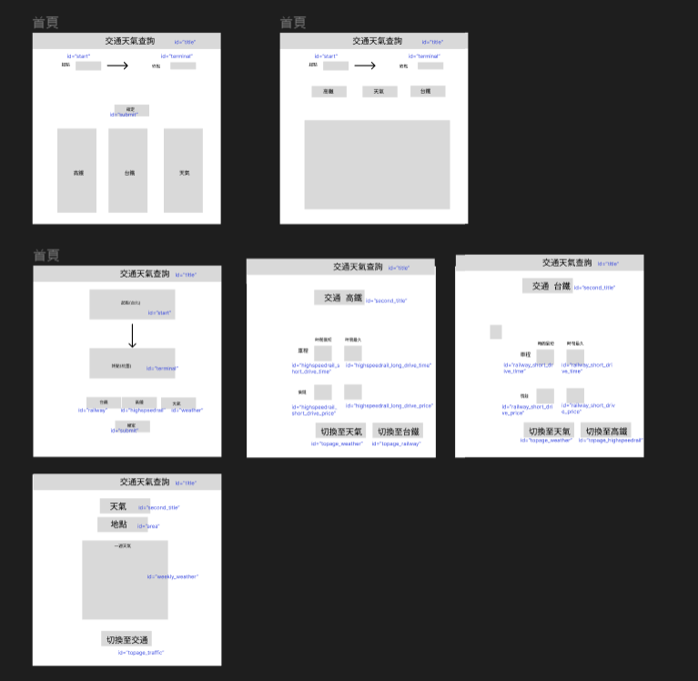

# 題目：trafficXweather
## 主要功能：
#### 查詢交通所花費時間及金額(依照高鐵站為主)，以及目的地站的一週天氣。
## 實測網址：https://chiayingc.github.io/trafficXweather/
## Figma草圖：
[Figma draft](https://www.figma.com/file/oFWSqY2UkKcVMAnh1rT4bY/week7%E5%8D%94%E4%BD%9C?node-id=9%3A3&t=nFZK1eTYF5qPHjfh-0).

## 分工：

| 項目  | 負責人員 |
| ------------- |:-------------:|
| 切版      | 陳佳瑩    |
| 首頁      | 蕭士晟    |
| 高鐵      | 周品甄    |
| 台鐵      | 陳冠守    |
| 天氣      | 簡劭芸    |

## 檔案：
**HTML** 

1. index.html	  	 ___*陳佳瑩*

**JS** 

1. option.js	  	 ___*蕭士晟*
1. railway.js	  	 ___*陳冠守*
1. highspeedrail.js	  	 ___*周品甄*
1. weather.js	  	 ___*簡劭芸*

**CSS** 

1. index.css	  	 ___*陳佳瑩*
1. weather.css	  	 ___*簡劭芸*